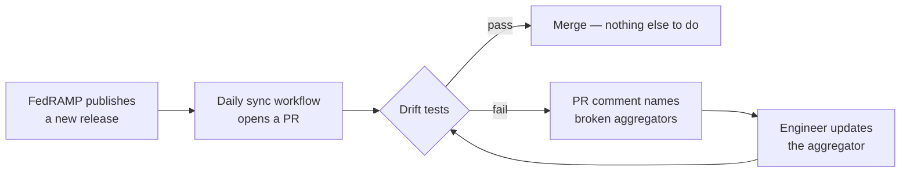

# grc-toolkit

**Machine-readable compliance evidence, pulled directly from the source.**

Connect to AWS / GCP / Azure / Okta / SIEM / IdP. Run deterministic Python aggregators
against live state. Emit a FedRAMP package — Rev 5 or 20x, whichever path your
authorization is on.

## The problem this solves

Compliance documentation is hand-typed today. An engineer reads the AWS console,
writes a paragraph in Word saying "we use FIDO2 hardware keys," and a 3PAO reads
that paragraph and tries to verify it. The paragraph and the live system drift
apart. Nobody catches it until the next assessment.

The fix is to **never let humans hand-type the implementation status**. Instead:

1. **Connectors** call the source system (Okta, AWS IAM, KMS, CloudTrail, etc.)
   and return raw evidence.
2. **Aggregators** apply deterministic rules to that evidence and emit one
   per-control determination — with a timestamp, a real metric, and the live
   numbers ("3/3 privileged users compliant; 4/4 total humans compliant").
3. **Renderers** take those determinations and emit whatever FedRAMP-shaped
   document the CSP needs.

The implementation status is **observed**, not asserted. A 3PAO reviewing the
output can re-run the tool and get byte-identical results, because it's
deterministic Python — not an LLM reasoning over the evidence.

## Pick your FedRAMP path

A CSP picks **one** FedRAMP path. The toolkit supports both, so you don't have
to refactor your authoring layer if you change paths or migrate from Rev 5 → 20x:

| Path | Output | When you'd use it |
|---|---|---|
| **Rev 5 (traditional)** | Word SSP (`.docx`) | What most CSPs submit today. 3PAO reviews the Word doc. |
| **Rev 5 (machine-readable)** | OSCAL 1.2.0 JSON | FedRAMP PMO has signaled they will mandate machine-readable Rev 5 packages. OSCAL is the most likely target since NIST + FedRAMP already publish OSCAL profiles for the Rev 5 baselines. |
| **20x** | FRMR JSON (FedRAMP machine-readable) | The new authorization path. Phase 2 pilot ended March 2026; general availability later in 2026. |

You **don't run more than one path at a time** — that's not how FedRAMP works.
But because the source is the same set of aggregators, you can switch paths
later without rewriting any compliance logic. That's the actual value:
**future-proofing your evidence pipeline against PMO direction.**

## How updates flow



The cost of a FedRAMP release becomes a PR review, not a content rewrite.

## Browse the catalog

- [**Capabilities catalog**](capabilities.md) — every aggregator with its control coverage
- [**Coverage matrix**](coverage.md) — which Rev 5 controls and KSIs have aggregators
- [**Architecture**](ARCHITECTURE.md) — connector / aggregator / renderer separation
- [**3PAO Validation**](3pao-validated.md) — provenance map of validated patterns
- [**Related work**](related-work.md) — how this relates to other GRC engineering projects

## Quick start

```bash
git clone https://github.com/NPounds711/grc-toolkit.git
cd grc-toolkit
pip install -r requirements.txt

# Run the full pipeline against fixtures (no AWS / Okta credentials required)
pytest -v

# Render whichever output your FedRAMP path requires:
python -m renderers.rev5_ssp   --out samples/rev5_ssp.docx        --fixtures tests/fixtures
python -m renderers.oscal_ssp  --out samples/rev5_oscal.json      --fixtures tests/fixtures --impact Moderate
python -m renderers.fedramp_20x --out samples/20x.json            --fixtures tests/fixtures
```

To run against your real cloud and SaaS state, set the connector env vars
(`OKTA_DOMAIN`, `OKTA_API_TOKEN`, `AWS_PROFILE`, …) and drop the `--fixtures` flag.

## License

Apache 2.0. **This tool produces evidence and artifacts. A 3PAO must still
attest. Nothing in this repo is legal or compliance advice.**
