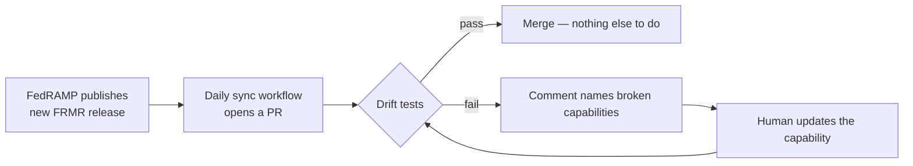

# grc-toolkit

**Dual-format GRC tooling for FedRAMP Rev 5 and 20x. Author once, render to any framework.**

## The problem

CSPs running both Rev 5 and 20x today maintain two parallel sets of compliance
artifacts. The SSP says "we use FIDO2 MFA," the 20x KSI package says
"WebAuthn enforced," and they drift because they have no single source of
truth.

When FedRAMP renames a KSI (which they do every couple of months), every
hand-curated mapping in the world breaks. Tools that depend on FedRAMP
content can't compete by trying to stay current manually — they have to be
architecturally subscribed to the source of truth.

## The fix

You author a **capability** once — the actual security claim about your
system — and the toolkit generates whatever framework artifact the audience
needs.

```yaml
# capabilities/iam/mfa-phishing-resistant.yaml
id: cap-mfa-phishing-resistant
capability_statement: |
  All human user authentication requires phishing-resistant MFA using
  FIDO2/WebAuthn hardware keys, enforced at the IdP with no bypass path.
satisfies:
  fedramp_20x:
    - { ksi: KSI-IAM-01, coverage: full }
  fedramp_rev5:
    - { control: IA-2, coverage: full }
    - { control: IA-2(1), coverage: full }
  soc2:
    - { criterion: CC6.1 }
```

One file. Three frameworks. The Rev 5 SSP, the 20x package, and the SOC 2
description all stay consistent because they're rendered from the same
source.

## How it stays current



The cost of a FedRAMP release becomes a PR review, not a content rewrite.

## Browse the catalog

- [**Capabilities catalog**](capabilities.md) — every authored capability with its framework mappings
- [**Coverage matrix**](coverage.md) — which KSIs and controls are covered, which aren't
- [**Architecture**](ARCHITECTURE.md) — three-layer separation that keeps this from going stale
- [**3PAO Validation**](3pao-validated.md) — provenance map of which patterns have cleared real assessments

## Quick start

```bash
git clone https://github.com/REPLACE_WITH_YOUR_ORG/grc-toolkit.git
cd grc-toolkit
pip install -r requirements.txt

# Generate a Rev 5 SSP fragment (Word doc)
python -m renderers.rev5_ssp --out samples/ssp.docx

# Generate a 20x machine-readable package (JSON)
python -m renderers.fedramp_20x --out samples/20x.json \
    --csp "Acme Federal" --cso "Acme Workspace" --impact Low
```

See [Contributing](https://github.com/REPLACE_WITH_YOUR_ORG/grc-toolkit/blob/main/CONTRIBUTING.md)
for how to add a capability, evidence collector, or renderer.

## License

Apache 2.0. **This tool produces evidence and artifacts. A 3PAO must still
attest. Nothing here is legal or compliance advice.**
